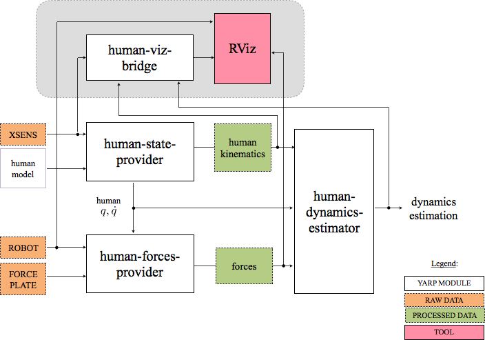

## YARP module for the Human Dynamics Estimation (HDE).

[](https://travis-ci.org/robotology-playground/human-dynamics-estimation) [](https://ci.appveyor.com/project/claudia-lat/human-dynamics-estimation/branch/master)\
Human Dynamics Estimation (HDE) is a YARP module architecture for the estimation of the dynamics in humans while are physically interacting with a robot.


###  Contents
* **[Rationale](#rationale)**
* **[Overview](#overview)**
* **[How to install](#how-to-install)**
* **[Dependencies](#dependencies)**
* **[Documentation](#documentation)**
* **[Reference paper](#reference-paper)**
* **[Acknowledgments](#acknowledgments)**


### Rationale
HDE is the *on-line* evolution of the Matlab code present in [MAPest](https://github.com/claudia-lat/MAPest) repository.  The general idea is to be able in real-time to estimate the forces acting on the human body during a physical interaction with a robot. 
A ROS-based visualizer allows to visualize in real-time this interaction.


### Overview
A general overview of HDE is described as follows: 
- a [human-state-provider](human-state-provider) module;
- a [human-forces-provider](human-forces-provider) module;
- a [human-dynamics-estimator](human-dynamics-estimator) module;
- the [human-viz-bridge](human-viz-bridge) module for the visualization.



The data about the human kinematics are provided to the *human-state-provider* module by the YARP interface `yarp::dev::IFrameProvider`.  [Here](https://github.com/robotology-playground/xsens-mvn) there is the implementation of the YARP driver for acquiring data if the motion capture is obtained through a Xsens MVN system. 
The data related to the external forces are provided to the  *human-forces-provider* module whether the forces are coming from a YARP port (e.g.,in the case of the robot wrenches) or in the form of a AnalogSensor -by using the `yarp::dev::IAnalogSensor` interface- when they are coming from a force-torque device (see [here](https://github.com/robotology-playground/forcetorque-yarp-devices) the implementation of YARP Device Drivers for various commercial Six Axis Force Torque sensors).
The human model is a URDF model with its non standard extended version (see [here](https://github.com/robotology/idyntree/blob/master/doc/model_loading.md) for more details). 


### How to install
On Linux:
```
git clone https://github.com/robotology-playground/human-dynamics-estimation.git
mkdir build
cd build
ccmake ..
make install
```


### Dependencies
#### Build dependencies
- [CMake](https://cmake.org)
- [YCM](http://robotology.github.io/ycm/gh-pages/master/index.html)

#### Libraries
- [YARP](https://github.com/robotology/yarp)
- [iDynTree](https://github.com/robotology/idyntree)
- [Eigen](http://eigen.tuxfamily.org/index.php?title=Main_Page)

#### Optional dependencies
- [IPOPT](https://projects.coin-or.org/Ipopt) is needed for using the inverse kinematics code in the [human-state-provider](human-state-provider) module
- ROS dependencies are needed if you want to visualize the human in Rviz tool.  More details [here](human-viz-bridge).


## Documentation
The documentation for HDE is automatically extracted from the C++ code using [Doxygen](www.doxygen.org),
and it is available [here](https://robotology-playground.github.io/human-dynamics-estimation/).


## Reference paper
The HDE theoretical background is described in the following [paper](http://www.mdpi.com/1424-8220/16/5/727).
~~~
Latella, C.; Kuppuswamy, N.; Romano, F.; Traversaro, S.; Nori, F.	
Whole-Body Human Inverse Dynamics with Distributed Micro-Accelerometers, Gyros and Force Sensing. 
Sensors 2016, 16, 727.
~~~

The bibtex code for including this citation is provided:
~~~
@article{Latella_2016, 
title={Whole-Body Human Inverse Dynamics with Distributed Micro-Accelerometers, Gyros and Force Sensing}, 
volume={16}, 
ISSN={1424-8220}, 
url={http://dx.doi.org/10.3390/s16050727}, 
DOI={10.3390/s16050727}, number={5}, journal={Sensors}, 
publisher={MDPI AG}, 
author={Latella, Claudia and Kuppuswamy, Naveen and Romano, Francesco and Traversaro, Silvio and Nori, Francesco}, 
year={2016}, 
month={May}, 
pages={727}}
~~~


### Acknowledgments
The development of HDE is supported by the FP7 EU projects [CoDyCo (No. 600716 ICT 2011.2.1 Cognitive
Systems and Robotics)](http://www.codyco.eu/) and by H2020 EU projects [An.Dy (No. 731540 H2020-ICT-2016-1)](http://andy-project.eu).
The development is also supported by the [Istituto Italiano di Tecnologia](http://www.iit.it).

