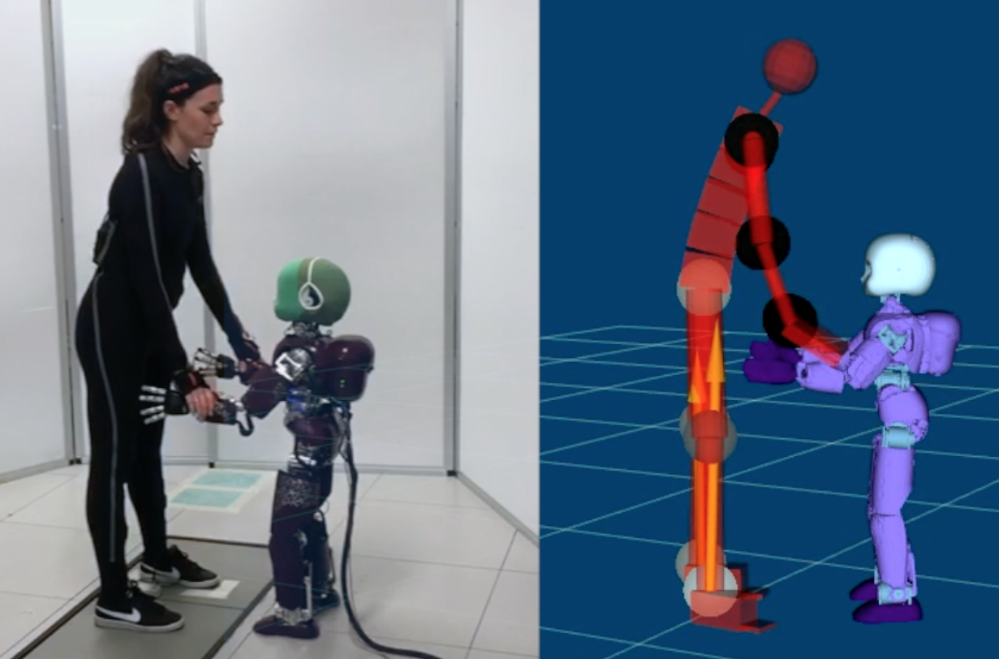

# YARP module for the Human Dynamics Estimation (HDE)

| Linux/macOS | Windows |
|:----------:|:--------:|
[](https://travis-ci.org/robotology/human-dynamics-estimation) | [](https://ci.appveyor.com/project/claudia-lat/human-dynamics-estimation/branch/master)|

Human Dynamics Estimation (HDE) is a collection of YARP modules for the estimation of the dynamics in humans while physically interacting with a robot.


##  Contents
* **[Rationale](#rationale)**
* **[Overview](#overview)**
* **[How to use it](#how-to-use-it)**
* **[Dependencies](#dependencies)**
* **[How to install](#how-to-install)**
* **[Documentation](#documentation)**
* **[Reference paper](#reference-paper)**
* **[Acknowledgments](#acknowledgments)**


## Rationale
HDE is the *on-line* evolution of the Matlab code present in [MAPest](https://github.com/claudia-lat/MAPest) repository.  The general idea is to be able in real-time to estimate the forces acting on the human body during a physical interaction with a robot. 
A ROS-based visualizer allows to visualize in real-time this interaction.


## How to use it
The best way to use this repository is to exploit all the available suggested tools that allow you to have the real-time forces and motion estimation. 



For reproducing the same experimental set-up as in figure, you would need the following dependencies:
- the iCub robot
- the Rviz visualizer

If you are using them, you don't have to modify this code.
Clearly, they are not dependencies in terms of software but in terms of tools for which the code is tailored.  If you want to use another visualizer or another robot, keep in mind that the code requires minor modifications.

## Overview
A general overview of HDE is described as follows: 
- a [human-state-provider](human-state-provider) module;
- a [human-forces-provider](human-forces-provider) module;
- a [human-dynamics-estimator](human-dynamics-estimator) module;
- the [human-viz-bridge](human-viz-bridge) module for the visualization.


*What about the raw data?*

The data about the human kinematics are provided to the *human-state-provider* module by the YARP interface `yarp::dev::IFrameProvider`.  [Here](https://github.com/robotology-playground/xsens-mvn) there is the implementation of the YARP driver for acquiring data if the motion capture is obtained through a Xsens MVN system. 
The data related to the external forces are provided to the  *human-forces-provider* module whether the forces are coming from a YARP port (e.g.,in the case of the robot wrenches) or in the form of a AnalogSensor -by using the `yarp::dev::IAnalogSensor` interface- when they are coming from a force-torque device (see [here](https://github.com/robotology-playground/forcetorque-yarp-devices) the implementation of YARP Device Drivers for various commercial Six Axis Force Torque sensors).
The human model is a URDF model with its non standard extension (see [here](https://github.com/robotology/idyntree/blob/master/doc/model_loading.md) for more details). 


## Dependencies
Here following there is a list of dependencies you need for using this repository.  It is worth to notice that the *build* ones and the *libraries* are mandatory to install your project. Instead, the *optional dependencies* are defined optional in the sense that the project is built even if they are not included.  The installation of the all dependencies  is strongly suggested if you want to have a visual feedback of how much your estimation is good.

For installing the dependencies you can decide to install them individually or to use the [codyco-superbuild](https://github.com/robotology/codyco-superbuild) that automatically is in charge of installing all the dependencies you need (except for the optional ones).  Keep in mind that the `codyco-superbuild` is surely the fastest way to install them but it contains many more things than you need!

#### Build dependencies
- [**CMake**](https://cmake.org/download/): an open-source, cross-platform family of tools designed to build, test and package software.
- [**YCM**](http://robotology.github.io/ycm/gh-pages/master/manual/ycm-installing.7.html): a CMake project whose only goal is to download and build several other projects.

#### Libraries
- [**YARP**](https://github.com/robotology/yarp): a library and toolkit for communication and device interfaces.
- [**iDynTree**](https://github.com/robotology/idyntree): a library of robots dynamics algorithms for control, estimation and simulation.
- [**Eigen**](http://eigen.tuxfamily.org/index.php?title=Main_Page): a C++ template library for linear algebra.
- [**IPOPT**](http://wiki.icub.org/wiki/Installing_IPOPT): a software package for large-scale nonlinear optimization for the inverse kinematics code in the [human-state-provider](human-state-provider) module.

#### Optional dependencies
- [**ROS**](http://wiki.ros.org): an open-source provider of libraries and tools for creating robot applications.  More details for the installation [here](human-viz-bridge).


## How to install
Finally, after having installed the dependencies, you can install the HDE project:
```bash
git clone https://github.com/robotology-playground/human-dynamics-estimation.git
mkdir build
cd build
```

```bash
cmake -DCMAKE_INSTALL_PREFIX=/path/to/your/installation/folder -G "name-of-your-cmake-generator" ..
```
where the `name-of-your-cmake-generator` is your project generator, see [Cmake-Generators](https://cmake.org/cmake/help/latest/manual/cmake-generators.7.html). For example, on macOS you may choose `Xcode`, or on Unix `Unix Makefiles`.

Then, for compiling
```
cmake --build . --config Release
```
and installing
```
cmake --build . --config Release --target install
```


## Documentation
The documentation for HDE is automatically extracted from the C++ code using Doxygen, and it is available [here](https://robotology.github.io/human-dynamics-estimation/html/annotated.html) .


## Reference paper

A new paper describing the software architecture has been accepted for publishing on IEEE RA-L.
Link will follow soon.

The HDE theoretical background is described in the following [paper](http://www.mdpi.com/1424-8220/16/5/727).
~~~
Latella, C.; Kuppuswamy, N.; Romano, F.; Traversaro, S.; Nori, F.	
Whole-Body Human Inverse Dynamics with Distributed Micro-Accelerometers, Gyros and Force Sensing. 
Sensors 2016, 16, 727.
~~~

The bibtex code for including this citation is provided:
~~~
@article{Latella_2016, 
title={Whole-Body Human Inverse Dynamics with Distributed Micro-Accelerometers, Gyros and Force Sensing}, 
volume={16}, 
ISSN={1424-8220}, 
url={http://dx.doi.org/10.3390/s16050727}, 
DOI={10.3390/s16050727}, number={5}, journal={Sensors}, 
publisher={MDPI AG}, 
author={Latella, Claudia and Kuppuswamy, Naveen and Romano, Francesco and Traversaro, Silvio and Nori, Francesco}, 
year={2016}, 
month={May}, 
pages={727}}
~~~


## Acknowledgments
The development of HDE is supported by the FP7 EU projects [CoDyCo (No. 600716 ICT 2011.2.1 Cognitive
Systems and Robotics)](http://www.codyco.eu/) and by H2020 EU projects [An.Dy (No. 731540 H2020-ICT-2016-1)](http://andy-project.eu).
The development is also supported by the [Istituto Italiano di Tecnologia](http://www.iit.it).

