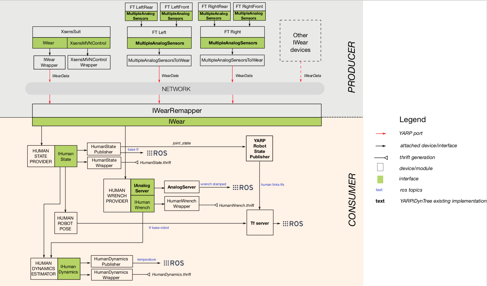

# YARP devices for the Human Dynamics Estimation (HDE)

[](https://github.com/robotology/human-dynamics-estimation/actions/workflows/ci.yml)

Human Dynamics Estimation (HDE) is a collection of YARP devices for the online estimation of the kinematics and dynamics of a human subject monitored with a set of wearable sensors and/or interacting with a robot. A ROS-based visualizer allows to visualize in real-time the output of the estimation. The devices can be installed and run in Linux, MacOS and Windows.


##  Contents
* **[Overview](#overview)**
* **[Dependencies](#dependencies)**
* **[How to install](#how-to-install)**
* **[Applications](#applications)**
* **[Citing this work](#citing-this-work)**
* **[Acknowledgments](#acknowledgments)**

## Overview
The main devices contained in this project are the following:
- **HumanStateProvider**: solve inverse kinematics given a set of kinematic sensor.
- **HumanDynamicsEstimator**: solve the inverse dynamics given the kinematic state and a set of wrenches measurment.
- **RobotPositionControl**: controls the position of a robot with a given kinematic state.

The information coming from the sensors come in the form of the `IWear` [YARP interface](https://www.yarp.it/group__dev__iface.html), for more reference on how those are generated please refer to [`Wearables`](https://github.com/robotology/wearables). All the information exchanged among the HDE devices trough implmented in this project (`IHumanDynamics`, `IHumanState`, `IHumanWrench`) and can be published among a network using the coreresponding wrapper devices

A possible architecture integrating wearable sensors and HDE is described in the following scheme: 


## Dependencies
Here following there is a list of dependencies you need for using this repository.  It is worth to notice that the *build* ones and the *libraries* are mandatory to install your project. Instead, the *optional dependencies* are defined optional in the sense that the project is built even if they are not included.  The installation of the all dependencies  is strongly suggested if you want to have a visual feedback of how much your estimation is good.

For installing the dependencies you can decide to install them individually or to use the [robotology-superbuild](https://github.com/robotology/robotology-superbuild) with the `ROBOTOLOGY_ENABLE_DYNAMICS` option that automatically is in charge of installing all the dependencies you need (except for the optional ones).  Keep in mind that the `robotology-superbuild` is surely the fastest way to install them but it contains many more things than you need!

#### Build dependencies
- [**CMake**](https://cmake.org/download/): an open-source, cross-platform family of tools designed to build, test and package software.
- [**YCM**](http://robotology.github.io/ycm/gh-pages/master/manual/ycm-installing.7.html): a CMake project whose only goal is to download and build several other projects.

#### Libraries
- [**YARP**](https://github.com/robotology/yarp): a library and toolkit for communication and device interfaces.
- [**icub-main**](https://github.com/robotology/icub-main): a library for the interaction with the iCub robot.
- [**iDynTree**](https://github.com/robotology/idyntree): a library of robots dynamics algorithms for control, estimation and simulation.
- [**Wearables**](https://github.com/robotology/wearables): a library for communication and interfaces with wearable sensors.
- [**Eigen**](http://eigen.tuxfamily.org/index.php?title=Main_Page) (3.3 or later): a C++ template library for linear algebra.
- [**IPOPT**](http://wiki.icub.org/wiki/Installing_IPOPT): a software package for large-scale nonlinear optimization.
- [**Robometry**](https://github.com/robotology/robometry : a telemetry suite for logging data.

#### Optional dependencies
- [**ROS**](http://wiki.ros.org) with [**rviz**](http://wiki.ros.org/rviz) package: an open-source provider of libraries and tools for creating robot applications.
- [**irrlicht**](http://irrlicht.sourceforge.net/) and [**iDynTree**](https://github.com/robotology/idyntree) compiled with `IDYNTREE_USES_IRRLICHT` enabled: visualizer for floating-base rigid-body systems.

## How to install
After installing all the dependencies, you can install the HDE project:
```bash
git clone https://github.com/robotology-playground/human-dynamics-estimation.git
mkdir build
cd build
```

```bash
cmake -DCMAKE_INSTALL_PREFIX=/path/to/your/installation/folder -G "name-of-your-cmake-generator" ..
```
where the `name-of-your-cmake-generator` is your project generator, see [Cmake-Generators](https://cmake.org/cmake/help/latest/manual/cmake-generators.7.html). For example, on macOS you may choose `Xcode`, or on Unix `Unix Makefiles`.
You can configure the following optional cmake options:
- `HUMANSTATEPROVIDER_ENABLE_VISUALIZER`: enables the `irricht`-based iDynTree Visualizer

Then, for compiling
```bash
cmake --build . --config Release
```
and installing
```bash
cmake --build . --config Release --target install
```

## Applications
The code contained in this repository can serve different application. Depending on the type of application, a different set of hardware and sensors are required. In addiction, since the applications are based on [wearables devices](https://github.com/robotology/wearables), a certain number of wearable devices should be running providing the source sensor data.
The main applications are the following

| Application | hardware | werable device | 
|:----------:|:----------:|:----------:| 
| Inverse Kinematics | kinematic sensors | XsensSuit |
| Dynamics Estimation | kinematic sensors <br> FTshoes | XsensSuit <br> FTshoes |
| Whole-Body Retargeting | kinematic sensors | XsensSuit |

## How to run
### Applications
Documentation for running each specific application can be found at the following links:
- [Inverse Kinematics](/doc/how-to-run-inverse-kinematics.md)
- [Dynamics Estimation](/doc/how-to-run-dynamics-estimation.md)
- [Whole-Body Retargeting](/doc/how-to-run-whole-body-retargeting.md)

## Citing this work

Please cite the following publications if you are using the code contained in this repository for your own research and/or experiments:

#### MDPI Sensors

~~~
Simultaneous Floating-Base Estimation of Human Kinematics and Joint Torques.
Latella, C., Traversaro, S., Ferigo, D., Tirupachuri, Y., Rapetti, L., Andrade Chavez, F. J., Nori F., Pucci, D.
Sensors, 19(12), 2794., 2019, doi:
10.3390/s19122794
https://www.mdpi.com/1424-8220/19/12/2794
~~~

The bibtex code for including this citation is provided:

~~~
@article{latella2019simultaneous,
  title={Simultaneous floating-base estimation of human kinematics and joint torques},
  author={Latella, Claudia and Traversaro, Silvio and Ferigo, Diego and Tirupachuri, Yeshasvi and Rapetti, Lorenzo and Andrade Chavez, Francisco Javier and Nori, Francesco and Pucci, Daniele},
  journal={Sensors},
  volume={19},
  number={12},
  pages={2794},
  year={2019},
  publisher={Multidisciplinary Digital Publishing Institute}
}
~~~

#### IEEE Robotics and Automation Letters

~~~
The CoDyCo Project achievements and beyond: Towards Human Aware Whole-body Controllers for Physical Human Robot Interaction
Francesco Romano, Gabriele Nava, Morteza Azad, Jernej Camernik, Stefano Dafarra, Oriane Dermy, Claudia Latella, Maria Lazzaroni, Ryan Lober, Marta Lorenzini, Daniele Pucci, Olivier Sigaud, Silvio Traversaro, Jan Babic, Serena Ivaldi, Michael Mistry, Vincent Padois, Francesco Nori
IEEE Robotics and Automation Letters
DOI: 10.1109/LRA.2017.2768126
http://ieeexplore.ieee.org/document/8093992
~~~

The bibtex code for including this citation is provided:

~~~
@article{romano2017codyco,
  title={The CoDyCo Project achievements and beyond: Towards Human Aware Whole-body Controllers for Physical Human Robot Interaction},
  author={Romano, Francesco and Nava, Gabriele and Azad, Morteza and Camernik, Jernej and Dafarra, Stefano and Dermy, Oriane and Latella, Claudia and Lazzaroni, Maria and Lober, Ryan and Lorenzini, Marta and others},
  year={2017},
  DOI={10.1109/LRA.2017.2768126},
  publisher={IEEE}, 
  journal={IEEE Robotics and Automation Letters}, 
  url={http://ieeexplore.ieee.org/document/8093992}, 
}
~~~

## Acknowledgments
The development of HDE is supported by the FP7 EU projects [CoDyCo (No. 600716 ICT 2011.2.1 Cognitive
Systems and Robotics)](http://www.codyco.eu/) and by H2020 EU projects [An.Dy (No. 731540 H2020-ICT-2016-1)](http://andy-project.eu).
The development is also supported by the [Istituto Italiano di Tecnologia](http://www.iit.it).

